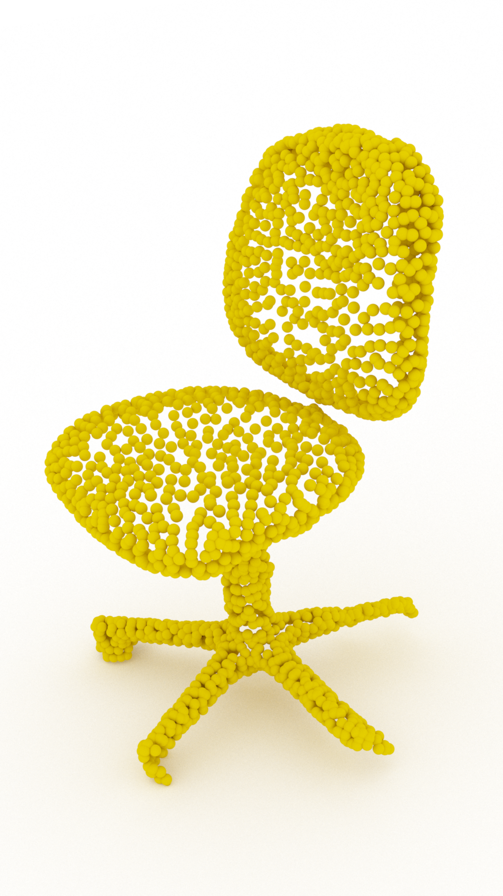
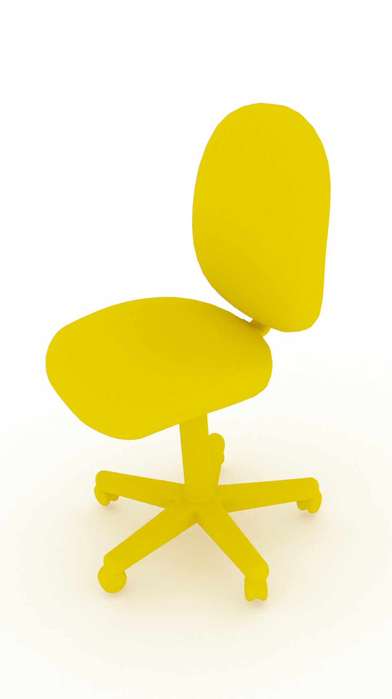
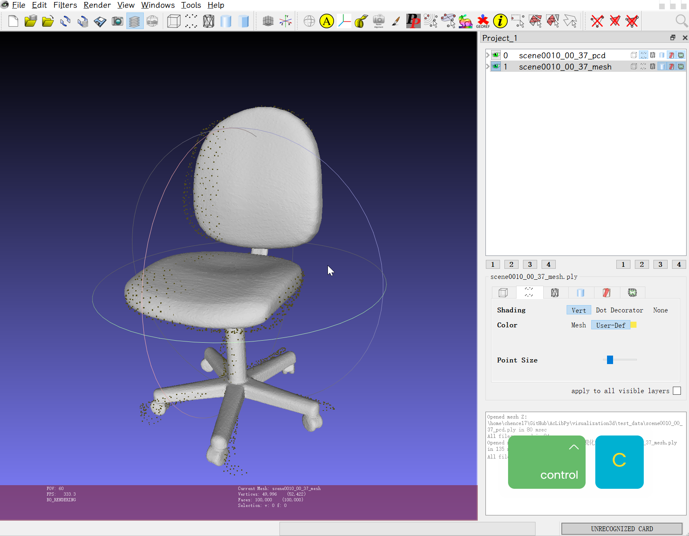
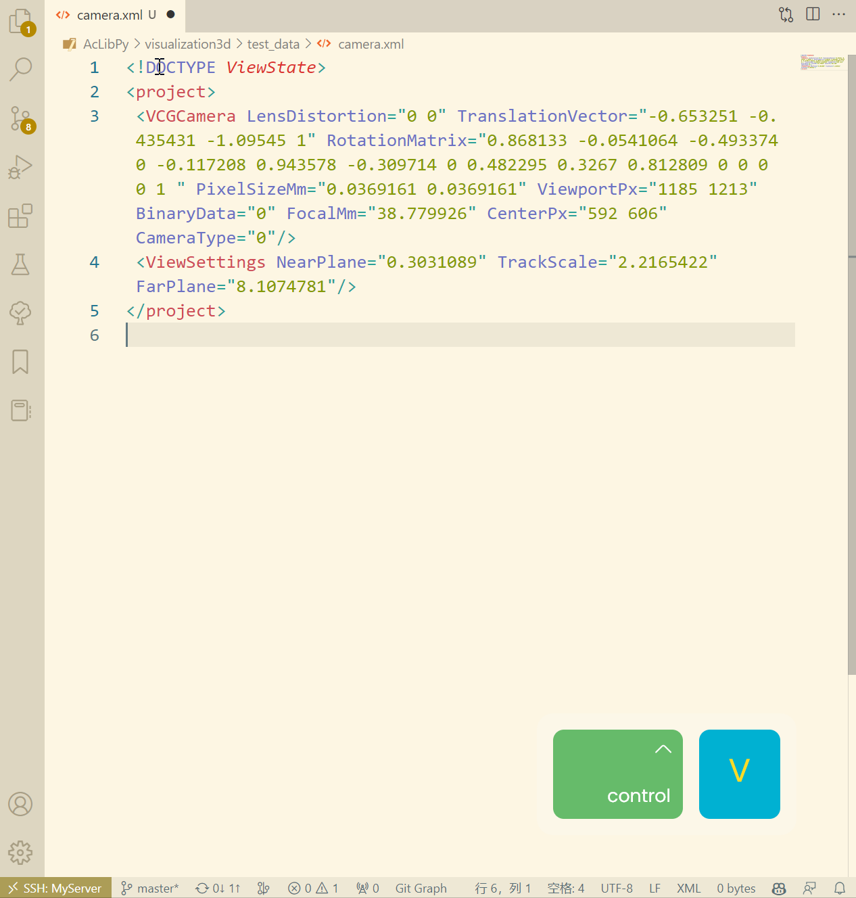

<!--
 * @Author: chence17 antonio.chan.cc@outlook.com
 * @Date: 2022-11-02 15:12:00
 * @LastEditors: chence17 antonio.chan.cc@outlook.com
 * @LastEditTime: 2022-11-04 14:57:51
 * @FilePath: /AcLibPy/visualization3d/README.md
 * @Description: 这是默认设置,请设置`customMade`, 打开koroFileHeader查看配置 进行设置: https://github.com/OBKoro1/koro1FileHeader/wiki/%E9%85%8D%E7%BD%AE
-->
# About

Render pointcloud and mesh using mitsuba3.

<table border="0">
<tr>
<td></td>
<td></td>
</tr>
</table>

# Requirements

- `python`
- [mitsuba3](https://mitsuba.readthedocs.io/en/stable/#installation): `pip install mitsuba`
- `numpy`, `plyfile`, `tqdm`, `matplotlib`
- `PyMeshLab`
- `MeshLab` software
- `jupyter notebook`, if you want run `visualize.ipynb`

# TODOs

- [ ] create videos from trajectory generated by given camera poses.

# Get camera.xml from meshlab

Open ply file using meshlab, choose a suitable view, press `ctrl+c` to copy camera information.

Then open the `camera.xml` file and press `ctrl+v` to paste the camera information.

<table border="0">
<tr>
<td></td>
<td></td>
</tr>
</table>

# Usage

Run the code with following commands:

```python
# for pointcloud
python pointcloud.py -pcd_file ./test_data/scene0010_00_37_pcd.ply -mi_var cuda_ad_rgb -save_dir ./test_data -camera_file ./test_data/camera.xml

# for mesh
python mesh.py -mesh_file ./test_data/scene0010_00_37_mesh.ply -mi_var cuda_ad_rgb -save_dir ./test_data -camera_file ./test_data/camera.xml
```

Usage for `pointcloud.py`:
```bash
$ python pointcloud.py -h
usage: pointcloud.py [-h] -pcd_file PCD_FILE -mi_var {scalar_rgb,scalar_spectral,cuda_ad_rgb,llvm_ad_rgb} -save_dir SAVE_DIR
                     [-sample_number SAMPLE_NUMBER] [-sample_method {random,fps}] [-sample_count SAMPLE_COUNT] [-width WIDTH] [-height HEIGHT]
                     [-camera_file CAMERA_FILE] [-pts_size PTS_SIZE] [-pts_color {light_blue,cornflower_blue,orange}]

Renser Pointcloud

optional arguments:
  -h, --help            show this help message and exit
  -pcd_file PCD_FILE    path to pointcloud file, support .ply file
  -mi_var {scalar_rgb,scalar_spectral,cuda_ad_rgb,llvm_ad_rgb}
                        set mitsuba.variant when rendering, set cuda_ad_rgb for GPU parallels if exists, set llvm_ad_rgb for CPU parallels
  -save_dir SAVE_DIR    folder to save rendered image
  -sample_number SAMPLE_NUMBER
                        down-sampling number when load pcd, <=0 means no down-sampling
  -sample_method {random,fps}
                        down-sampling method, choose from random and fps
  -sample_count SAMPLE_COUNT
                        specify the sample times when rendering, the higher the better
  -width WIDTH          rendered image width, default 1080
  -height HEIGHT        rendered image height, default 1920
  -camera_file CAMERA_FILE
                        path to camera.xml file, default None to use default camera
  -pts_size PTS_SIZE    point size of each point in pointcloud when rendering
  -pts_color {light_blue,cornflower_blue,orange}
                        point color of each point in pointcloud when rendering
```

Usage for `mesh.py`:
```bash
$ python mesh.py -h
usage: mesh.py [-h] -mesh_file MESH_FILE -mi_var {scalar_rgb,scalar_spectral,cuda_ad_rgb,llvm_ad_rgb} -save_dir SAVE_DIR
               [-sample_count SAMPLE_COUNT] [-width WIDTH] [-height HEIGHT] [-camera_file CAMERA_FILE]
               [-mesh_color {light_blue,cornflower_blue,orange}]

Renser Mesh

optional arguments:
  -h, --help            show this help message and exit
  -mesh_file MESH_FILE  path to mesh file, support .ply file
  -mi_var {scalar_rgb,scalar_spectral,cuda_ad_rgb,llvm_ad_rgb}
                        set mitsuba.variant when rendering, set cuda_ad_rgb for GPU parallels if exists, set llvm_ad_rgb for
                        CPU parallels
  -save_dir SAVE_DIR    folder to save rendered image
  -sample_count SAMPLE_COUNT
                        specify the sample times when rendering, the higher the better
  -width WIDTH          rendered image width, default 1080
  -height HEIGHT        rendered image height, default 1920
  -camera_file CAMERA_FILE
                        path to camera.xml file, default None to use default camera
  -mesh_color {light_blue,cornflower_blue,orange}
                        color of mesh when rendering
```

# Reference

- [OuyangJunyuan/PointCloudRenderer](https://github.com/OuyangJunyuan/PointCloudRenderer)
- [chrdiller/mitsuba-visualize](https://github.com/chrdiller/mitsuba-visualize)
- [cnr-isti-vclab/PyMeshLab](https://github.com/cnr-isti-vclab/PyMeshLab)
